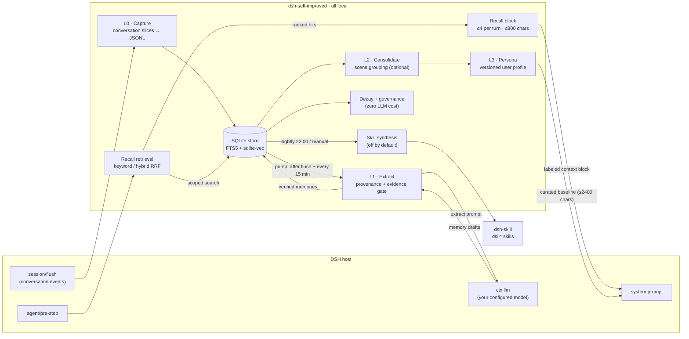
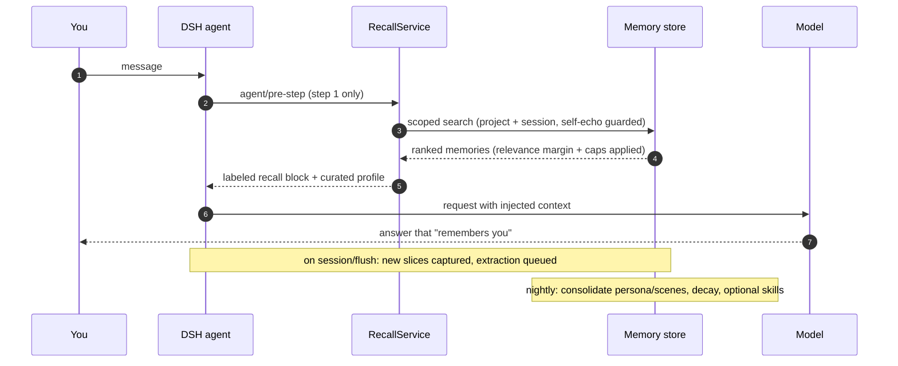

# dsh-self-improved

**Give your DeepSeek Harness agent a memory: fully local.**

 

`dsh-self-improved` is a plugin for **DeepSeek Harness (DSH)**: **cross-session long-term memory** and **self-evolution** in local SQLite + JSONL storage.

## Why would I need this?

Without it, every new DSH session starts blank:

- **You repeat yourself.** Stack, server, conventions, preferences: re-explained every session.
- **Good decisions evaporate.** The agent re-litigates settled questions and re-makes settled mistakes.
- **No persona builds up.**

With it, the agent walks in already knowing what you taught it before, and what worked can be distilled into reusable skills (opt-in).

## What you get

| Capability | What it does | Where it shows up |
|---|---|---|
| **Cross-session memory** | Distills facts / preferences / events into durable memories | Injected before each turn |
| **Relevant recall** | Only memories matching the current question, scoped to project and session | Labeled block in context; generic prompts inject nothing |
| **Evolving persona** | Strongest confirmed memories become a versioned profile | Curated baseline in the system prompt |
| **Skill synthesis** | Successful workflows become `dsh-skill` skills | `dsi-*` in your skills root; off by default |
| **Self-maintenance** | Decay and growth caps, zero LLM cost | Every maintenance round |
| **History search** | Full-text search over memories and past conversations | `memory_search` / `conversation_search` tools |
| **Your control** | Correct or forget any memory instantly | `/memory` + Settings → Evolving Memory |

## How it works

Hangs off DSH's native extension points (`session/flush`, `agent/pre-step`, `systemPrompt`, `ctx.llm`, settings namespaces, `dsh-skill`). Four-layer pipeline (L0 capture → L1 extraction → L2 consolidation → L3 persona), inspired by [TencentDB Agent Memory](https://github.com/TencentCloud/TencentDB-Agent-Memory):



1. **Capture**: session flush events persist as JSONL slices tagged with project scope; delegated sessions are never treated as your statements.
2. **Extract**: an LLM pass distills pending slices into memories that pass the strict gate (direct-human provenance, verbatim evidence, not task-local), JSON-validated and deduplicated.
3. **Consolidate**: the nightly review builds scenes (optional) and a versioned persona from your strongest confirmed memories.
4. **Recall**: before each turn, keyword/hybrid retrieval (RRF, optional embeddings) renders matching memories as a labeled, fallible block; the curated profile renders in the system prompt.
5. **Maintain**: decay retires stale memories; caps bound growth; optional skill synthesis writes `dsh-skill` entries.

### A turn, end to end



### When things run

| Trigger | What runs | LLM cost |
|---|---|---|
| Every turn (session flush) | capture slices, queue extraction | 0 |
| Right after flush + every 15 min | extraction pump, decay, governance caps | one small call, when new content exists |
| Nightly (default **22:00**), ~60s after boot, or `/memory evolve` | full review: drain extraction + consolidation + skills (optional) + decay/governance | moderate |
| Before each model call | recall retrieval + injection | 0 (keyword) / one embedding call (hybrid) |
| `/memory` commands, memory browser | local store queries only | 0 |

## Memory policy

High-signal by default (Hermes-conservative). A memory becomes durable only if it comes from direct human input (assistant prose, tool output, and injected text are filtered out), carries a verbatim evidence quote, and is not task or session local.

Recall = a small curated baseline (pinned, human-corroborated profile facts, in the system prompt) + contextual recall: only memories matching the current question, capped by relevance margin, importance floor, and 4 blocks per turn.

Nothing is deleted silently: upgrading an existing store quarantines pre-upgrade rows (`provenance=unknown`) until you confirm them (`accept-legacy`). Corrections via `/memory correct` or the browser's Correct action apply immediately and mark the memory human-confirmed; the `memory_correct` tool only stages a candidate until you confirm it.

## Privacy

- Store: `$DSH_HOME/memory` (configurable). The plugin itself calls no network services; model and embedding traffic follows your DSH configuration.
- Master switch off = dormant: extraction, recall, the `/memory` command, and memory tools stop; memories are kept and everything resumes when re-enabled.

## Installation

```bash
dsh plugin --profile web add github:asheghi/dsh-self-improved
```

Restart dsh after installing. The npm/marketplace name `dsh-self-improved` resolves to a different project, not this one.

Install pitfalls (pnpm store and build prep, peerDependencies double instance, duplicate loader entry id): [TROUBLESHOOTING.md](./TROUBLESHOOTING.md).

### Local development (file: link)

```bash
# build, then copy lib/ + client.js + package.json into
# $DSH_HOME/profiles/web/node_modules/dsh-self-improved/
# add "dsh-self-improved": "file:node_modules/dsh-self-improved" to package.json dependencies
# add the cordis.patch.yml insert (see TROUBLESHOOTING.md), then restart
```

## Operations

### Dry-run migration (`scripts/migrate-hermes.mjs`)

```bash
pnpm run migrate:hermes -- --dir ~/.dsh/memory --dry-run      # analysis only, source db untouched
pnpm run migrate:hermes -- --dir ~/.dsh/memory --no-dry-run   # real run; a pre-hermes store is backed up to memory.db.pre-hermes.bak first
```

Dry-run first. The real run never deletes anything (rows collapse to `supersedes` links; summary in `memory/migration-log/`). A pre-hermes store is backed up to `memory.db.pre-hermes.bak` before any schema change (kept if a backup already exists); that backup is the rollback point.

### Generated-skill audit (dry-run by default)

```bash
pnpm run skills:audit -- --root ~/.dsh/skills            # dry run (default)
pnpm run skills:audit -- --root ~/.dsh/skills --apply    # archive redundant skills
```

Audits `dsi-*` skills for duplicates and high body overlap; `--apply` moves redundant ones into `<root>/.dsi-archive/<timestamp>/`, never deletes, and fixes retained skills whose frontmatter name disagrees with their directory. Idempotent; only `dsi-*` directories with `SKILL.md` are classified.

## Configuration

```yaml
# $DSH_HOME/settings.yaml
dsh-self-improved:
  enabled: true
  modules:
    capture: true
    extract: true
    consolidate: true
    evolve: true
    recall: true
    tools: true
  review:
    enabled: true      # nightly review (one full evolution per day)
    time: "22:00"      # HH:MM, 24h
```

- Conservative defaults are settings, not hardcode; all editable in the settings UI ("Evolving Memory" → Config): `extract.provenanceFilter: "strict"`, `extract.requireEvidence: true`, `recall.relevanceMargin: 0.5`, `recall.minImportance: 0`, `recall.maxInjectPerTurn: 4`, `consolidate.scenesEnabled: false`, `evolve.skillSynthesis.enabled: false`.
- `/memory` commands are zero-LLM.

## Repository layout

| Path | What it is |
|---|---|
| `src/*.ts` | TypeScript sources: the plugin's server side |
| `lib/` | Compiled output (`tsc`); what npm ships |
| `client.js` | Web UI half: "Evolving Memory" settings + memory browser (no build step) |
| `scripts/` | Ops scripts and test runners |
| `cordis.patch.yml` | Bundle mount declaration (auto-applied via `dsh.bundle`) |

Tests: `pnpm run test:all`; runners in `scripts/test-*.mjs`.

## Compliance and acknowledgements

- Architecture inspired by [TencentDB Agent Memory](https://github.com/TencentCloud/TencentDB-Agent-Memory) (Tencent Cloud): the four-layer memory pyramid is the direct inspiration for this pipeline; independent implementation, no affiliation with Tencent.
- Self-evolution design inspired by [self-improving-agent](https://github.com/pskoett/self-improving-agent) (pskoett).

## Docs

- `README.md`: this file
- `ROADMAP.md`: milestones and plan history
- `TROUBLESHOOTING.md`: install pitfalls and fixes
- `docs/` (design docs, testing guide, DSH research): local only, excluded via `.gitignore`

## License

MIT License. See [LICENSE](./LICENSE) for the full text.

Copyright (c) 2026 mashao.
