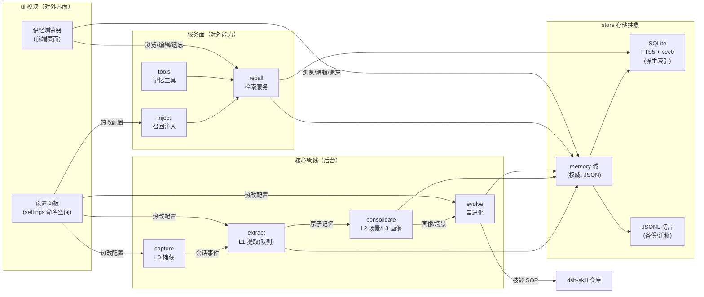
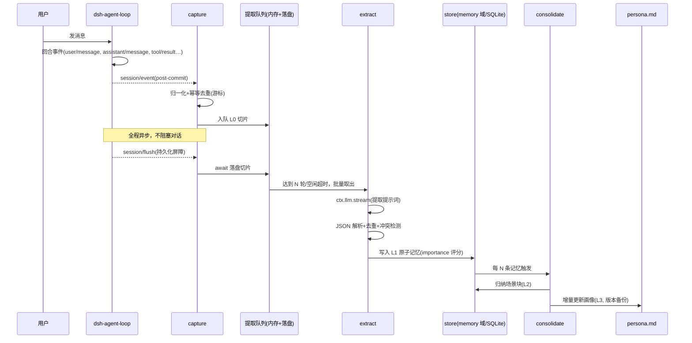
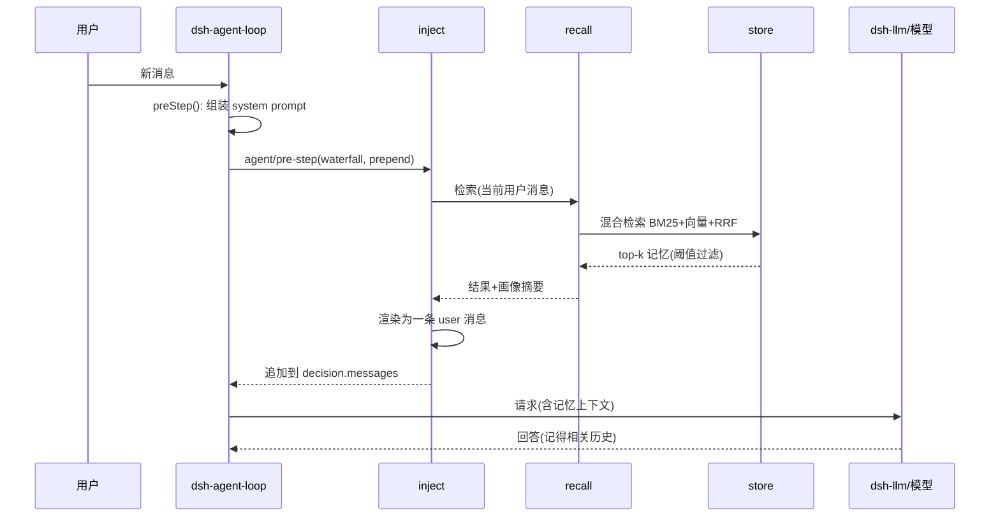
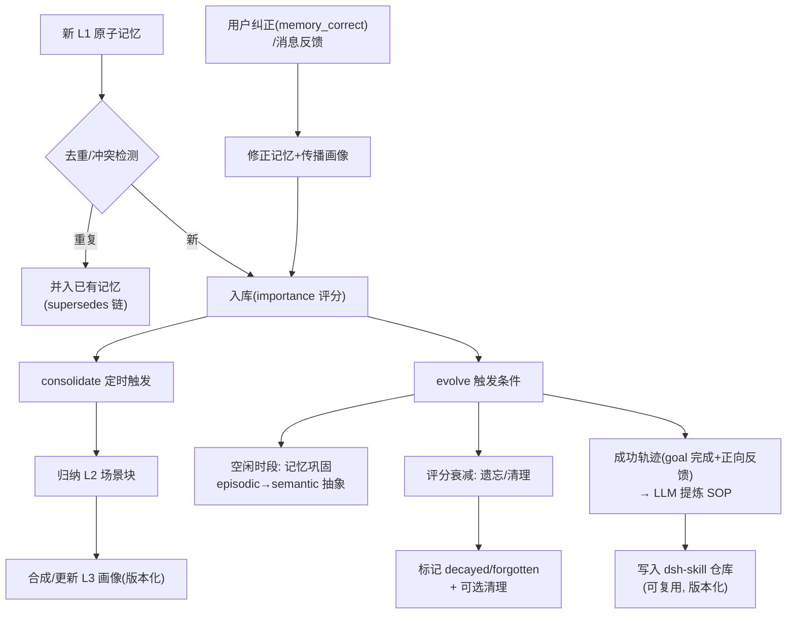
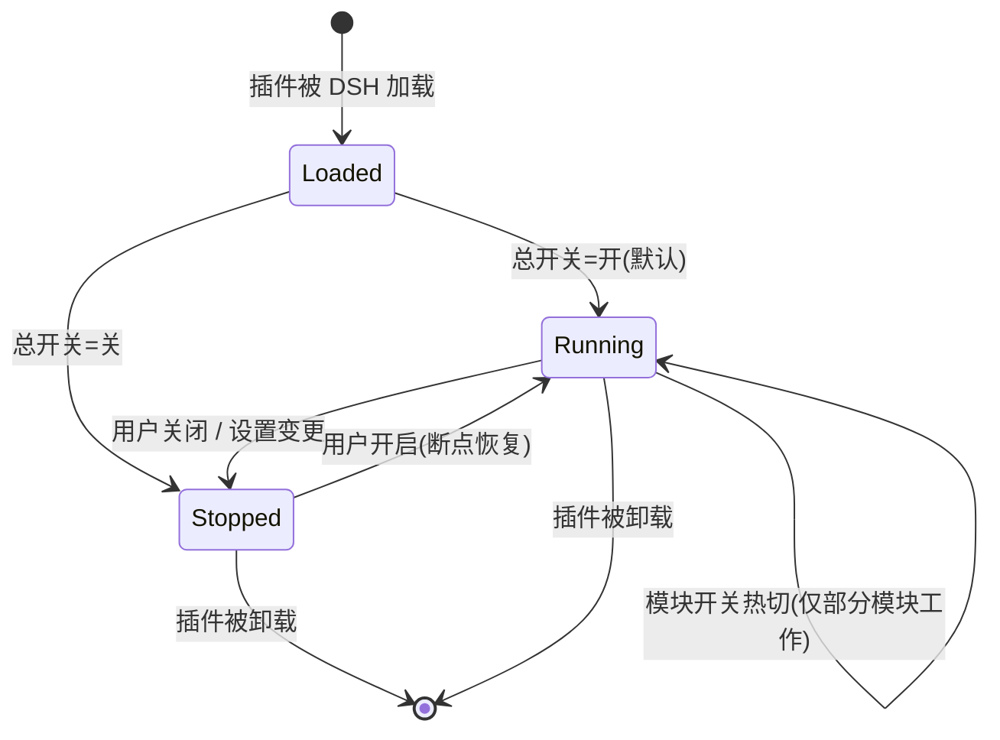

# dsh-memory 细化设计：架构图 / UI 交互 / 运行时启停

> 配套主文档：`design/dsh-memory-plugin-design.md`（总体架构、数据模型、自进化、路线图、合规）
> 本文件回答三个问题：① 插件到底长什么样（架构图）；② 怎么随时开/关；③ 界面上怎么操作。
> 状态：细化设计 v1.0（2026-05）｜纯本地模式

---

## 1. 架构图集（先看图，再看文）

### 1.1 总览：dsh-memory 在 DSH 里的位置（上下文图）

```
┌─────────────────────────────────────────────────────────────────────────────┐
│                        DSH profile（web / headless）                          │
│                                                                             │
│  ┌──────────────┐   用户消息/回合事件    ┌───────────────────────────────┐   │
│  │ dsh-agent-loop│ ───────────────────▶ │         dsh-memory 插件        │   │
│  │ (智能体回合循环) │                      │                               │   │
│  └──────┬───────┘                      │  ┌───────────────────────────┐ │   │
│         │ ① 会话事件(session/event,      │  │ capture  L0 对话捕获       │ │   │
│         │    session/flush)              │  └──────────┬────────────────┘ │   │
│         ▼                                │             ▼                  │   │
│  ┌──────────────┐   ② 召回注入            │  ┌───────────────────────────┐ │   │
│  │ dsh-system-   │ ◀──────────────────── │  │ extract  L1 记忆提取(队列)  │ │   │
│  │ prompt 装配    │  (agent/pre-step)     │  └──────────┬────────────────┘ │   │
│  └──────┬───────┘                        │             ▼                  │   │
│         ▼                                │  ┌───────────────────────────┐ │   │
│  ┌──────────────┐   ③ LLM 调用           │  │ consolidate L2/L3 巩固      │ │   │
│  │ dsh-llm      │ ◀──────────────────── │  └──────────┬────────────────┘ │   │
│  └──────┬───────┘                        │             ▼                  │   │
│         ▼                                │  ┌───────────────────────────┐ │   │
│  ┌──────────────┐   ④ 记忆工具调用        │  │ evolve  自进化(巩固/遗忘/技能)│ │   │
│  │ dsh-tools    │ ◀──────────────────── │  └──────────┬────────────────┘ │   │
│  └──────┬───────┘                        │             │ ⑤ 检索             │   │
│         ▼                                │  ┌──────────▼────────────────┐ │   │
│  ┌──────────────┐   ⑥ 后台调度           │  │ recall 检索服务(BM25+向量+  │ │   │
│  │ dsh-schedule │ ◀──────────────────── │  │        RRF 混合)            │ │   │
│  └──────────────┘                        │  └──────────┬────────────────┘ │   │
│  ┌──────────────┐   ⑦ 技能读写           │             │                  │   │
│  │ dsh-skill    │ ◀──────────────────── │  ┌──────────▼────────────────┐ │   │
│  └──────────────┘                        │  │ store  存储抽象            │ │   │
│  ┌──────────────┐   ⑧ 设置/存储域         │  │  sqlite(权威域)+vec+JSONL  │ │   │
│  │ dsh-settings │ ◀──────────────────── │  └──────────┬────────────────┘ │   │
│  └──────────────┘                        │             │                  │   │
│                                          │  ┌──────────▼────────────────┐ │   │
│                                          │  │ ui     设置面板+记忆浏览器   │ │   │
│                                          │  └───────────────────────────┘ │   │
│  ┌──────────────┐                        └───────────────────────────────┘   │
│  │ Web 前端      │ ◀──── 设置/浏览记忆 ────┘                                 │
│  │ (浏览器)      │                                                            │
│  └──────────────┘                                                            │
└─────────────────────────────────────────────────────────────────────────────┘
        ▲
        │ 磁盘（全部在本机，纯本地）
        ▼
┌─────────────────────────────────────────────────────────────────────────────┐
│ $DSH_HOME/                                                                │
│ ├─ sessions/…/session.jsonl.zstd      DSH 自带会话日志（只读）               │
│ ├─ storages/memory.json               记忆权威域（本插件所有）               │
│ ├─ memory/                            派生索引（可重建）                     │
│ │   ├─ conversations/  L0 提取输入切片                                    │
│ │   ├─ records/        L1 原子记忆 JSONL                                  │
│ │   ├─ scenes/         L2 场景块 .md                                      │
│ │   ├─ persona.md      L3 画像（带 .bak）                                  │
│ │   ├─ memory.db       SQLite（memories+FTS5）                            │
│ │   └─ vectors.db      sqlite-vec（向量索引）                              │
│ └─ skills/                            进化出的技能（dsh-skill 可加载）        │
└─────────────────────────────────────────────────────────────────────────────┘
```

要点：
- **插件是一套"钩子 + 后台管线"**：它不自己跑模型循环，而是挂在 DSH 的回合循环上"顺手做事"（捕获、注入、提供工具），主线对话完全不受影响。
- **所有数据在本机**：对话原文用 DSH 已有的日志，记忆本体用自己的存储域。
- **随时可摘**：插件加载/卸载不影响 DSH 本体；插件内部还有"软开关"（第 2 节）。

### 1.2 插件内部模块结构（组件图）



模块职责一句话版：

| 模块 | 一句话 | 平时在干嘛 |
|---|---|---|
| capture | 记录 | 每回合把对话切片排队给提取 |
| extract | 提炼 | 后台把对话切片"读一遍"→ 原子记忆 |
| consolidate | 归纳 | 定期把记忆归成场景、合成画像 |
| evolve | 进化 | 巩固、遗忘、提炼技能、吸收纠正 |
| recall | 检索 | 按关键词/语义找出相关记忆 |
| inject | 注入 | 回合开始前把相关记忆塞给模型 |
| tools | 工具 | 模型主动搜索/修正/遗忘记忆的入口 |
| store | 存储 | 记忆落盘与索引 |
| ui | 界面 | 设置开关、浏览/编辑记忆 |

### 1.3 写入路径时序（capture → extract → consolidate）



### 1.4 召回注入时序（回合开始前）



- 超时保护：检索 5s 上限，失败/超时 → 跳过注入，对话照常进行。
- 稳定内容（画像摘要/场景目录）走 `systemPrompt.context`，变更才更新，省 token。

### 1.5 自进化管线流程



### 1.6 数据模型（ER 图，纯本地 SQLite）

```mermaid
erDiagram
    SESSION ||--o{ L0_SLICE : "产生"
    L0_SLICE ||--o{ MEMORY : "提取出"
    MEMORY }o--|| SCENE : "归纳到"
    SCENE ||--|| PERSONA : "合成"
    MEMORY ||--o{ MEMORY : "supersedes(修正链)"
    MEMORY ||--|| EMBEDDING : "有向量"
    PERSONA ||--o{ PERSONA_VERSION : "历史版本"

    SESSION { string id PK }
    L0_SLICE { string id PK, string session_id, int turn, int seq, string kind, string text, int ts }
    MEMORY { string id PK, string kind, string content, int importance, int access_count, int created_at, int updated_at, string status, string supersedes }
    EMBEDDING { string memory_id FK, blob vector, int dims }
    SCENE { string id PK, string title, string markdown, int created_at, json memory_ids }
    PERSONA { string id PK, string content, int updated_at }
    PERSONA_VERSION { int ver PK, string content, int created_at }
```

### 1.7 运行时启停状态机（第 2 节详解）



---

## 2. 运行时"随时开启/关闭"设计

### 2.1 需求与原则

- 用户随时可以**一键关闭**（不再注入、不再提炼、不再占用资源），也可以**随时再开**，**无需重启 DSH**。
- 关闭 ≠ 删除数据：记忆全部保留，重开后续用（断点恢复）。
- 开关粒度：**总开关 + 模块开关**，满足"只关注入但继续记录"这类精细需求。
- 切换无感：毫秒级生效，正在进行的回合不被打断（下一回合生效）。

### 2.2 三层开关体系

| 层级 | 名称 | 在哪操作 | 效果 |
|---|---|---|---|
| L0 | DSH 插件级停用 | Web UI 插件管理 / `cordis.patch.yml` | 整个插件从运行时卸载（Cordis 层，最彻底；需重新加载启用） |
| L1 | **总开关 `enabled`**（本插件） | 设置面板一键开关 / settings.yaml | 停掉全部监听、工具、定时器；保留数据；热切换 |
| L2 | 模块开关 ×6 | 设置面板细粒度开关 | 单独控制 capture/extract/consolidate/evolve/recall+inject/tools |

默认：安装后 L1=开，L2 全开（零配置可用）。

### 2.3 实现机制（通俗版）

- **每个"活动"都留下一个拔插头（disposer）**：监听器注册、工具注册、动态上下文段、定时任务，注册时 DSH 都会返回一个"撤销函数"。插件把它们收集在一个清单里。
- **关闭 = 依次拔插头**：拔掉事件监听（不再捕获）、拔掉注入钩子（模型不再看到记忆）、拔掉工具（模型找不到记忆工具）、取消定时器（后台管线停摆）。
- **开启 = 重新插上**：重新注册全部插头，并从**持久化的游标**（上次捕获到哪了）继续干活；停用期间的对话不补录（可配"开启后补录"）。
- **热生效**：设置面板改动 → 监听 `settings/updated` 事件 → 重读配置 → 按需拔/插对应插头。**不用重启**（比 dsh-tdai-memory 的"改完要重启"更好）。

### 2.4 状态与转换动作表

| 转换 | 做什么 | 数据影响 |
|---|---|---|
| Running → Stopped | 拔全部插头；把内存队列落盘；记录停用时间戳 | 无丢失；队列保留 |
| Stopped → Running | 重新注册；读取游标继续 | 断点续捕；可选补录窗口 |
| 模块级切换 | 只拔/插对应模块的插头 | 联动规则见 2.5 |

### 2.5 模块开关联动规则（防止"关了 A 忘了 B"的坑）

| 你关了… | 会发生什么 | 提醒 |
|---|---|---|
| capture | 不再记录新对话；extract 继续消化已有队列 | 停用期间的对话不会被记忆 |
| extract | 不提炼新记忆；recall 用旧记忆 | 记忆停留在关闭时刻 |
| consolidate | L2/L3 不更新 | 画像陈旧 |
| evolve | 不巩固/不遗忘/不提技能 | 记忆只增不减，可能膨胀 |
| recall+inject | 模型不再自动"想起"；但 tools 仍可用（模型可主动搜） | 最省 token 的模式 |
| tools | 模型无法主动搜索/修正记忆 | 只剩自动注入 |

### 2.6 数据安全

- 关闭/开启只动"运行时状态"，不动存储（memory 域、SQLite、JSONL）。
- 游标、队列、停用时间戳都持久化在 memory 域，崩溃/重启后自动恢复。
- 停用期间 DSH 本体照常工作，插件零开销（无监听、无定时器）。

---

## 3. UI 交互设计

### 3.1 集成方式（两个层级）

| 层级 | 做法 | 投入 | 包含内容 |
|---|---|---|---|
| A. 设置面板（必须，M2 起） | `ctx.settings.register('dsh-memory', schema)`，Web UI 设置页自动渲染表单 | 低（纯配置 schema） | 总开关、模块开关、模型/存储参数 |
| B. 记忆浏览器页面（建议，M5） | 按 DSH 客户端模块约定（`dsh-client-ui-*` 模式）新增前端页面 | 中（前端开发，需在 M0 验证约定） | 记忆/场景/画像/技能/统计的浏览与编辑 |

### 3.2 设置面板（Web UI 设置 → dsh-memory 节）

```
┌─ dsh-memory 记忆插件 ────────────────────────────────────────────────┐
│                                                                    │
│  状态: ● 运行中（已捕获 128 条对话 / 已提炼 42 条记忆 / 队列 3）       │
│  [ ⚡ 一键开关 ]  [ 上次活动: 2 分钟前 ]  [ 存储: 3.2 MB ]             │
│                                                                    │
│  ─ 基本 ─                                                          │
│  存储模式 ............. [纯本地 (sqlite-vec)     ▾]                  │
│  数据目录 ............. [E:\dsh\memory            ] (只读展示)        │
│                                                                    │
│  ─ 模块开关 ─                                                      │
│  ☑ 记录对话 (capture)          ☑ 提炼记忆 (extract)                 │
│  ☑ 归纳场景/画像 (consolidate)  ☑ 自进化 (evolve)                    │
│  ☑ 自动召回注入 (recall)        ☑ 记忆工具 (tools)                   │
│  （每个开关右侧有"联动影响"小字提示，见 2.5）                          │
│                                                                    │
│  ─ 模型（提炼/画像用，默认跟随你当前选的模型） ─                       │
│  模型 .............. [跟随 DSH 默认 ▾]  [测试按钮]                   │
│  触发频率 .......... 每 5 轮对话 或 空闲 60 秒                        │
│                                                                    │
│  ─ 隐私 ─                                                          │
│  保留天数 .......... [90 天 (0=永久)]                                │
│  [ 立即清空全部记忆 ] [ 导出记忆备份 ]                                │
└────────────────────────────────────────────────────────────────────┘
```

交互要点：
- 顶部**状态条**：运行状态、关键计数、存储占用、最近活动时间——一眼看清插件在干嘛。
- **一键开关**是最大最显眼的按钮；开关状态持久化，重启后保持。
- 每个模块开关旁有"联动影响"说明（hover 提示），避免用户误关。
- "测试按钮"：点一下调一次提炼模型，返回成功/失败与耗时，当场验证模型配置（解决 dsh-tdai-memory 那种"配置了但悄悄失败"的问题）。
- 所有更改**即时生效**（settings/updated 热应用），面板右上角出现"已保存，立即生效"提示。

### 3.3 记忆浏览器页面（Web UI 新增页）

```
┌─ dsh-memory · 记忆浏览器 ───────────────────────────────────────────┐
│  [搜索框: 关键词/一句话描述] [🔍 语义] [混合▾] [相似度阈值 0.3]  [新建] │
│  ┌─ 标签页 ────────────────────────────────────────────────────────┐
│  │ [记忆库 L1] [对话 L0] [场景 L2] [用户画像 L3] [技能] [统计]       │
│  └────────────────────────────────────────────────────────────────┘
│                                                                   │
│  记忆库标签页（默认）：                                             │
│  ┌─────────────────────────────────────────────────────────────┐  │
│  │ [📌 偏好] 用户偏好用 PowerShell 而非 cmd            ★★★ 7次 │  │
│  │           来源: 会话 #… · 3 天前 · 重要度 8/10      [编辑][遗忘]│  │
│  ├─────────────────────────────────────────────────────────────┤  │
│  │ [🧭 事件] 5/14 完成支付模块迁移，耗时约 4 小时        ★★  2次 │  │
│  │           来源: 会话 #… · 5 天前 · 重要度 6/10      [编辑][遗忘]│  │
│  ├─────────────────────────────────────────────────────────────┤  │
│  │ [📖 事实] 项目 E:\dshPro 使用 pnpm 管理依赖            ★★  3次 │  │
│  │           来源: 会话 #… · 1 周前 · 重要度 7/10      [编辑][遗忘]│  │
│  └─────────────────────────────────────────────────────────────┘  │
│  [上一页] 第 1/12 页 [下一页]   每页 20 条                          │
└────────────────────────────────────────────────────────────────────┘
```

各标签页交互：

| 标签页 | 内容 | 操作 |
|---|---|---|
| 记忆库 L1 | 原子记忆列表（类型徽标/内容/来源/重要度/访问次数） | 搜索、筛选（按类型/时间/重要度）、**编辑**、**纠正**（改后沿 supersedes 链传播到画像）、**遗忘**、导出 |
| 对话 L0 | 原始对话全文搜索（复用 `ctx.sessionQuery`） | 关键词检索、跳转到来源会话 |
| 场景 L2 | 场景块目录（Markdown，含来源记忆列表） | 展开阅读、重命名、删除 |
| 用户画像 L3 | persona 当前版 + 版本历史 | 阅读、手动编辑、回滚到旧版本 |
| 技能 | 进化出的 SOP 列表 | 查看内容、启用/禁用（联动 dsh-skill）、删除 |
| 统计 | 记忆总数/类型分布/增长曲线/存储占用/token 节省估算 | 只读 |

### 3.4 关键交互流程（场景故事）

**场景 A：第一次使用**
1. 安装插件 → 自动启用（零配置）→ 设置面板顶部出现状态条。
2. 当天正常聊天，无任何打扰；后台悄悄捕获并提炼。
3. 次日新开会话，问"我昨天说用哪个 shell 来着？" → 模型答出 PowerShell，并显示注入来源小字（可选开关）。

**场景 B：一键关闭与重开**
1. 开会时不想让 AI 读记忆 → 设置面板点"一键关闭" → 状态变"已停用"，全部插头拔掉。
2. 重开 → 状态变"运行中"，从断点继续；停用期间的对话不补录（默认）。

**场景 C：纠正一条错误记忆**
1. 发现 AI 记错了偏好（"用户用 cmd"）→ 记忆浏览器找到这条，点"纠正"。
2. 输入正确内容 → 系统标记旧记忆 superseded，并把纠正传播给画像。
3. 之后 AI 不再犯同样错误。

**场景 D：看到自进化发生**
1. 多次成功完成"用 pnpm 更新依赖"类任务 → 统计页/技能页出现一条新技能。
2. 技能可被 dsh-skill 机制加载，下次同类任务 AI 自动参考它。
3. 用户可禁用该技能或删除。

### 3.5 错误与边界交互

| 情况 | 交互 |
|---|---|
| 提炼模型返回坏 JSON | 后台自动重试→降级为原文摘要；状态条显示"最近一次提炼失败"，可点击看日志 |
| 检索超时 | 跳过注入，对话照常；日志记录 |
| 存储空间/条数超限 | 按保留策略自动清理（可配置）；面板提示 |
| 记忆库损坏 | 用 memory 域 JSON + JSONL 双写重建派生索引（可重建，不丢权威数据） |
| headless 命令行 | 无 UI：通过 settings.yaml 与 `/memory` 命令控制（M5 提供 CLI 子命令） |

### 3.6 视觉与文案规范（简要）

- 复用 DSH Web UI 现有主题与组件（不另起炉灶）。
- 记忆类型徽标：📌偏好 / 🧭事件 / 📖事实 / 📋指令。
- 重要度用 ★×N；状态用色点（绿=运行/灰=停用/黄=有错误）。
- 文案口语化、带"联动影响"提示，避免术语。

---

## 4. 里程碑重排（UI 与启停归属）

| 里程碑 | 新增内容（相对主文档路线图） |
|---|---|
| M0 探针 | 验证接线时**一并验证**：运行时拔/插插头机制、`settings/updated` 热应用（这是 UI 开关的地基） |
| M2 提取管线 | 设置面板基本字段（总开关+extract 参数），状态条雏形 |
| M3 召回注入 | 注入开关热切验证；"最近活动"计数 |
| M4 自进化 | 记忆浏览器第一版（L1 列表+编辑/遗忘/纠正），统计页雏形 |
| M5 打磨 | 记忆浏览器完整版（L0/L2/L3/技能/统计标签页）、CLI 子命令、导出/备份 UI |

## 5. 待验证点（M0 必须落实）

1. `ctx.settings` 的 `settings/updated` 事件是否在 Web UI 修改后即时触发（决定"即时生效"能否实现）。
2. 工具/钩子/动态上下文段的 disposer 语义（决定拔插头机制的可行性）。
3. Web UI 新增页面的客户端模块约定（`dsh-client-ui-*` 模式，决定记忆浏览器的实现方式）。
4. sqlite-vec 与 node:sqlite（DSH 用的 SQLite 版本）的兼容性。
